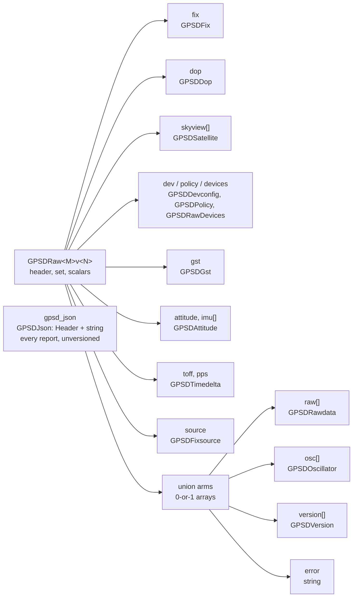

# Structure of the raw GPSd messages

`gpsd_client` mirrors GPSd's `struct gps_data_t` into ROS messages. This
document describes the shape of those messages and how it varies by GPSd C API
version. For the GPSd behaviours the mirror has to accommodate, see
[gpsd-quirks.md](gpsd-quirks.md).

## One set of types per API version

GPSd changes `gps_data_t` between API versions: it moves members between
structs, renames them, and changes their signedness. A single ROS message
cannot describe all of those states, so `gps_extended_msgs` carries a complete
set of types per API `(MAJOR, MINOR)` pair, suffixed `<MAJOR>v<MINOR>`.

`gpsd_client` selects the set matching the `gps.h` it compiled against and
publishes `gps_extended_msgs/GPSDRaw<MAJOR>v<MINOR>`. Building against GPSd
3.27.5 publishes `GPSDRaw16v1`; against GPSd 3.20, `GPSDRaw9v0`.

Ten pairs exist, 9.0 through 16.1. `GPSD_API_MAJOR_VERSION` skips 15 — no GPSd
revision ever carried it — so there is no `GPSDRaw15v0`.

Distinct types per version also make the signedness changes safe. `rtcm3_t`'s
`tow` is `int64` through API 13 and `uint64` from API 14, under the same field
name. Separate ROS types stop a subscriber built against one version from
silently misreading the other.

## Top-level layout

`GPSDRaw16v1` holds a `std_msgs/Header`, the `set` report mask, the scalar
members of `gps_data_t`, and these sub-messages. It mirrors the parts of
`gps_data_t` a socket client can actually reach; what libgps cannot decode
travels on `gpsd_json` instead.



### Union arms are 0-or-1 arrays

`gps_data_t` carries an anonymous union: one report populates exactly one arm.
ROS messages have no union, so each arm becomes an array bounded to a single
element. An empty array means GPSd did not report that arm; one element means it
did. Read `set` to learn which arm the report filled.

### `skyview` is trimmed

GPSd sizes `skyview` as a fixed array of 140 or 184 entries and reports the
valid count separately. The message carries only the valid prefix, so
`skyview.size()` equals `satellites_visible`.

### RTCM and subframe travel as raw JSON

`GPSDRaw` omits `rtcm2`, `rtcm3` and `subframe`. Typed messages for those three
were 684 of roughly 905 generated types — 76% of the package — for data almost
no subscriber decodes. `publish_gpsd_json` instead publishes every report as
the JSON line libgps returned, on `gpsd_json`.

That carries **more** than the typed path could. libgps decodes 17 report
classes and silently drops the rest, so `gps_data_t::subframe` never populates
in a client — but `gps_read()` copies the line into the caller's buffer before
`gps_unpack()` looks at it, so SUBFRAME arrives on `gpsd_json` even though no
`GPSDRaw` field can ever hold it. Measured on `ublox-ned-m8t-sbfrx3`: 438 of
443 forwarded lines carried SUBFRAME, while `SET_SUBFRAME` appeared on 0 typed
reports.

`GPSDRaw` still copies the `set` mask verbatim, so `msg.set & SET_RTCM3` still
reports that GPSd decoded a correction — the same contract as AIS.

### `GPSDJson` is the one unversioned message

```
std_msgs/Header header   # stamped when gps_read() returned the line
string json              # one GPSd report, verbatim
```

Every other message mirrors a struct whose shape changes with the GPSd API, so
it carries the pair in its name. This one carries an opaque string, so a single
type serves all ten pairs — there is no `GPSDJson16v1`.

Each report is published once, stamped as it is read, rather than sampled once
per publish cycle.

### AIS is absent

`struct ais_t` is out of scope and no message carries it. `SET_AIS` remains
defined, so `msg.set & SET_AIS` reports that GPSd decoded AIS data this message
omits.

## What varies between API versions

19 versioned message families, plus the unversioned `GPSDJson`. 16 exist in all
ten API versions; three appear as GPSd adds struct members.

| Family | Present in | Reason |
|---|---|---|
| `GPSDLog` | 9.1 → | GPSd adds `gps_log_t` |
| `GPSDBaseline` | 13.0 → | GPSd adds `baseline_t` |
| `GPSDFixsource` | 14.0 → | GPSd adds `gps_data_t::source` |

Message count per version:

| API | 9.0 | 9.1 | 10.0 | 10.1 | 11.0 | 12.0 | 13.0 | 14.0 | 16.0 | 16.1 |
|---|---|---|---|---|---|---|---|---|---|---|
| Messages | 16 | 17 | 17 | 17 | 17 | 17 | 18 | 19 | 19 | 19 |

Moving RTCM and subframe onto `gpsd_json` removed most of the churn along with
most of the messages: the families that used to appear and disappear between
versions were overwhelmingly RTCM arms.

## Fields that move between versions

Some members change location rather than appearing or disappearing. The message
mirrors whichever layout its own version uses.

| Member | 9.0 – 9.1 | 10.0 → |
|---|---|---|
| Fix status | `status` on `GPSDRaw` | `fix.status` on `GPSDFix` |

| Member | 9.0 – 11.0 | 12.0 → |
|---|---|---|
| `attitude` | union arm | standalone member, plus `imu[]` |

## Reading the `set` mask

`set` is GPSd's report mask, copied undecoded. Test it with the `SET_*`
constants on the message:

```cpp
if (msg.set & gps_extended_msgs::msg::GPSDRaw16v1::SET_LATLON) {
  // fix.latitude and fix.longitude belong to this report
}
```

The constants carry GPSd's bit values with the name reversed — GPSd's
`LATLON_SET` becomes `SET_LATLON` — because `gps.h` defines the GPSd spellings
as preprocessor macros, which would otherwise replace the message constants
wherever both headers appear. GPSd assigns mask bits append-only, so mask tests
port across versions even though the message types do not.

The mask has a significant caveat for union arms; see
[gpsd-quirks.md](gpsd-quirks.md).

## Generation

`tools/generate_raw_msgs.py` reads GPSd's `gps.h` at ten revisions and writes
both the `.msg` files and the C++ fill code. Run it with `--check` to verify the
checked-in files match what it produces.

- [adding-a-gpsd-api-version.md](adding-a-gpsd-api-version.md) — procedure when
  GPSd bumps its API
