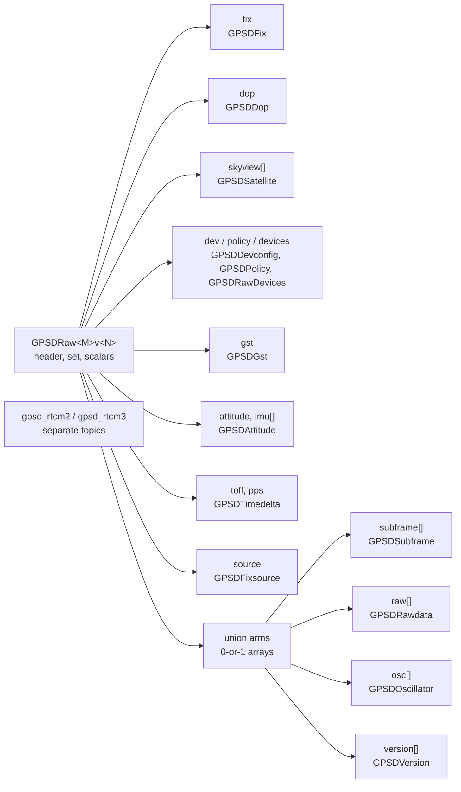

# Structure of the raw gpsd messages

`gpsd_client` mirrors gpsd's `struct gps_data_t` into ROS messages. This
document describes the shape of those messages and how it varies by gpsd C API
version. For the gpsd behaviours the mirror has to accommodate, see
[gpsd-quirks.md](gpsd-quirks.md).

## One set of types per API version

gpsd changes `gps_data_t` between API versions: it moves members between
structs, renames them, and changes their signedness. A single ROS message
cannot describe all of those states, so `gps_extended_msgs` carries a complete
set of types per API `(MAJOR, MINOR)` pair, suffixed `<MAJOR>v<MINOR>`.

`gpsd_client` selects the set matching the `gps.h` it compiled against and
publishes `gps_extended_msgs/GPSDRaw<MAJOR>v<MINOR>`. Building against gpsd
3.27.5 publishes `GPSDRaw16v1`; against gpsd 3.20, `GPSDRaw9v0`.

Ten pairs exist, 9.0 through 16.1. `GPSD_API_MAJOR_VERSION` skips 15 — no gpsd
revision ever carried it — so there is no `GPSDRaw15v0`.

Distinct types per version also make the signedness changes safe. `rtcm3_t`'s
`tow` is `int64` through API 13 and `uint64` from API 14, under the same field
name. Separate ROS types stop a subscriber built against one version from
silently misreading the other.

## Top-level layout

`GPSDRaw16v1` holds a `std_msgs/Header`, the `set` report mask, the scalar
members of `gps_data_t`, and these sub-messages:



### Union arms are 0-or-1 arrays

`gps_data_t` carries an anonymous union: one report populates exactly one arm.
ROS messages have no union, so each arm becomes an array bounded to a single
element. An empty array means gpsd did not report that arm; one element means it
did. Read `set` to learn which arm the report filled.

### `skyview` is trimmed

gpsd sizes `skyview` as a fixed array of 140 or 184 entries and reports the
valid count separately. The message carries only the valid prefix, so
`skyview.size()` equals `satellites_visible`.

### RTCM travels on its own topics

`GPSDRaw` omits RTCM2 and RTCM3. The two families make up roughly half of all
generated types, and a subscriber wanting a position rarely wants corrections,
so `gpsd_client` publishes them on `gpsd_rtcm2` and `gpsd_rtcm3` under
`publish_gpsd_rtcm`. `GPSDRaw` still copies the `set` mask verbatim, so
`msg.set & SET_RTCM3` still reports that gpsd decoded a correction.

`gpsd_client` publishes each RTCM message once, keyed on the report's JSON
class rather than on the mask. [gpsd-quirks.md](gpsd-quirks.md) explains why the
mask alone does not work for this.

### AIS is absent

`struct ais_t` is out of scope and no message carries it. `SET_AIS` remains
defined, so `msg.set & SET_AIS` reports that gpsd decoded AIS data this message
omits.

## What varies between API versions

75 of the 100 message families exist in all ten versions. The remaining 25
appear or disappear as gpsd adds and removes struct members.

| Family | Present in | Reason |
|---|---|---|
| `GPSDLog` | 9.1 → | gpsd adds `gps_log_t` |
| `GPSDOrbit` | 12.0 → | gpsd adds `orbit_t` |
| `GPSDBaseline` | 13.0 → | gpsd adds `baseline_t` |
| `GPSDFixsource` | 14.0 → | gpsd adds `gps_data_t::source` |
| `GPSDRtcm2Ecef` | 9.0 only | gpsd replaces the `rtcm2_t` ECEF arm |
| `GPSDRtcm2*` (7 families) | 9.1 → | gpsd expands `rtcm2_t` |
| `GPSDRtcm31016V`, `GPSDRtcm31017V` | 9.0 – 12.0 | gpsd removes these arms |
| `GPSDRtcm31021V`, `…1023V`, `…1025V` | 13.0 → | gpsd adds these arms |
| `GPSDRtcm3Msm*` (3 families) | 13.0 → | gpsd adds MSM support |
| `GPSDRtcm34076Hdr` | 14.0 → | gpsd adds the 4076 arm |
| `GPSDRtkSat`, `GPSDRtcmtypesRtcm31230V` | 9.1 → | gpsd expands `rtcm3_t` |

Message count per version:

| API | 9.0 | 9.1 | 10.0 | 10.1 | 11.0 | 12.0 | 13.0 | 14.0 | 16.0 | 16.1 |
|---|---|---|---|---|---|---|---|---|---|---|
| Messages | 78 | 88 | 88 | 88 | 88 | 89 | 95 | 97 | 97 | 97 |

RTCM accounts for most of the variation: 4 of its 63 families change shape
between versions and 20 do not exist in every version, which is more churn than
the rest of `gps_data_t` combined.

## Fields that move between versions

Some members change location rather than appearing or disappearing. The message
mirrors whichever layout its own version uses.

| Member | 9.0 – 9.1 | 10.0 → |
|---|---|---|
| Fix status | `status` on `GPSDRaw` | `fix.status` on `GPSDFix` |

| Member | 9.0 – 11.0 | 12.0 → |
|---|---|---|
| `attitude` | union arm | standalone member, plus `imu[]` |

## Reading the `set` mask

`set` is gpsd's report mask, copied undecoded. Test it with the `SET_*`
constants on the message:

```cpp
if (msg.set & gps_extended_msgs::msg::GPSDRaw16v1::SET_LATLON) {
  // fix.latitude and fix.longitude belong to this report
}
```

The constants carry gpsd's bit values with the name reversed — gpsd's
`LATLON_SET` becomes `SET_LATLON` — because `gps.h` defines the gpsd spellings
as preprocessor macros, which would otherwise replace the message constants
wherever both headers appear. gpsd assigns mask bits append-only, so mask tests
port across versions even though the message types do not.

The mask has a significant caveat for union arms; see
[gpsd-quirks.md](gpsd-quirks.md).

## Generation

`tools/generate_raw_msgs.py` reads gpsd's `gps.h` at ten revisions and writes
both the `.msg` files and the C++ fill code. Run it with `--check` to verify the
checked-in files match what it produces.

- [adding-a-gpsd-api-version.md](adding-a-gpsd-api-version.md) — procedure when
  gpsd bumps its API
