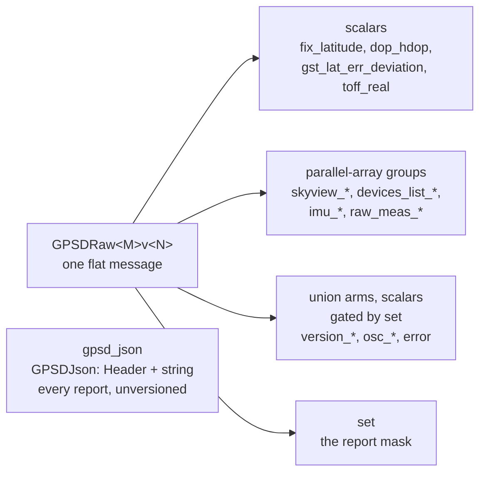

# Structure of the raw GPSd messages

`gpsd_client` mirrors GPSd's `struct gps_data_t` into ROS messages. This
document describes the shape of those messages and how it varies by GPSd C API
version. For the GPSd behaviours the mirror has to accommodate, see
[gpsd-quirks.md](gpsd-quirks.md).

## One set of types per API version

GPSd changes `gps_data_t` between API versions: it moves members between
structs, renames them, and changes their signedness. A single ROS message
cannot describe all of those states, so `gps_extended_msgs` carries a complete
set of types per API `(MAJOR, MINOR)` pair, suffixed `<MAJOR>v<MINOR>`.

`gpsd_client` selects the set matching the `gps.h` it compiled against and
publishes `gps_extended_msgs/GPSDRaw<MAJOR>v<MINOR>`. Building against GPSd
3.27.5 publishes `GPSDRaw16v1`; against GPSd 3.20, `GPSDRaw9v0`.

Ten pairs exist, 9.0 through 16.1. `GPSD_API_MAJOR_VERSION` skips 15 — no GPSd
revision ever carried it — so there is no `GPSDRaw15v0`.

Distinct types per version also make the signedness changes safe. `rtcm3_t`'s
`tow` is `int64` through API 13 and `uint64` from API 14, under the same field
name. Separate ROS types stop a subscriber built against one version from
silently misreading the other.

## Top-level layout

`GPSDRaw16v1` is **flat**: a `std_msgs/Header`, the `set` report mask, and every
value `gps_data_t` reaches, as a field on the message itself. No project-defined
sub-messages nest inside it — only `std_msgs` and `builtin_interfaces` types do.

It mirrors the parts of `gps_data_t` a socket client can actually reach; what
libgps cannot decode travels on `gpsd_json` instead.

274 fields at API 16.1, 166 at API 9.0. That is a lot to read at once, and it is
the point: one type per API version instead of a hundred.



Nothing below `GPSDRaw` is another generated message — those boxes are groups of
fields on the message itself.

### Names carry their path

A member's field name is its path through `gps_data_t`, joined with `_`:
`gps_fix_t::time` is `fix_time`, `satellite_t::elevation` is
`skyview_elevation`, `rawdata_t::meas[].svid` is `raw_meas_svid`.

The prefix is not decoration. Flattening to bare leaf names collides 63 times in
one API version — `time`, `status`, `temp`, `alt_hae` and others each occur in
several structs.

### Arrays of structs become parallel arrays

One array of structs becomes many arrays of scalars, one per member. Four groups
exist:

| Group | Length |
|---|---|
| `skyview_*` | `satellites_visible` |
| `devices_list_*` | `devices_ndevices` |
| `imu_*` | entries before the first empty `imu_msg` |
| `raw_meas_*` | `meas[]` entries with a usable `svid` |

**Every array in a group has the same length**, and index `i` refers to the same
satellite, device or measurement across all of them. The generated fill resizes
and writes each group from a single loop, so unequal lengths are not
representable rather than merely tested for.

```cpp
for (size_t i = 0; i < msg.skyview_prn.size(); ++i) {
  use(msg.skyview_prn[i], msg.skyview_elevation[i], msg.skyview_used[i]);
}
```

GPSd sizes `skyview` as a fixed array of 140 or 184 entries and reports the
valid count separately; only the valid entries are published.

One name to watch: **`skyview_time` is not part of the group.** It is
`gps_data_t::skyview_time`, a single timestamp for the whole report, and it is a
scalar. The `skyview_*` arrays come from `skyview[]`.

### Union arms are plain scalars, gated by the mask

`gps_data_t` carries an anonymous union: one report populates exactly one arm,
and the others share its storage. Those members are ordinary scalars on the
message — `version_release`, `osc_delta`, `error` — because a 0-or-1 array would
force `msg.osc_delta[0]` on every reader without saying anything the mask does
not.

**These are the only fields whose presence the mask decides.** Everything else
is filled on every report. Nothing in the message shape marks them, so the list
is here:

| Prefix | Read only when | Fields | Gated on |
|---|---|---|---|
| `raw_*` (incl. `raw_meas_*`) | `SET_RAW` | 17 | every version |
| `version_*` | `SET_VERSION` | 5 | every version |
| `osc_*` | `SET_OSCILLATOR` | 4 | every version |
| `error` | `SET_ERROR` | 1 | every version |
| `gst_*` | `SET_GST` | 8 | **API 9.0 – 13.0 only** |
| `attitude_*` | `SET_ATTITUDE` | 22 | **API 9.0 – 11.0 only** |

So 57 gated fields at API 9.0, 35 from API 12.0, and 27 from API 14.0 on.

```cpp
if (msg.set & gps_extended_msgs::msg::GPSDRaw16v1::SET_OSCILLATOR) {
  use(msg.osc_delta);           // meaningful only inside this guard
}
```

**Reading one without checking gives you a default, not a stale value.** The
parser builds a fresh message per report and copies an arm only when the mask
names it, so an ungated read yields `0` or `""` rather than data left over from
an earlier report. That is a deliberate guarantee, and a test pins it — but it
still tells you nothing about this report, so the guard is what you want.

The parser cannot simply copy every arm: reading one the mask does not name is a
read of an inactive union member, which is undefined behaviour rather than a
merely wrong number.

#### The list is version-dependent

Two members leave the union as GPSd evolves, and the field names do not change
when they do:

* **`attitude_*`** is union-carried on API 9.0 – 11.0 and an ordinary member
  from API 12.0.
* **`gst_*`** is union-carried on API 9.0 – 13.0 and an ordinary member from
  API 14.0.

On the later versions those fields are filled on every report and need no
guard. Code that must span versions can simply always check the bit: the mask
is still set when the data is present, so the guard is correct everywhere and
merely redundant on newer GPSd.

The generator decides this from the struct layout at each revision rather than
from a hand-kept list, and a test re-scans `gps_data_t`'s union out of `gps.h`
and fails if any published arm reaches the message without its guard.

`ais` and `navdata` are union arms this package does not publish at all, so no
field and no guard exists for them. `SET_AIS` still reports that GPSd decoded
AIS data the message omits.

### RTCM and subframe travel as raw JSON

`GPSDRaw` omits `rtcm2`, `rtcm3` and `subframe`. Typed messages for those three
were 684 of roughly 905 generated types — 76% of the package — for data almost
no subscriber decodes. `publish_gpsd_json` instead publishes every report as
the JSON line libgps returned, on `gpsd_json`.

That carries **more** than the typed path could. libgps decodes 17 report
classes and silently drops the rest, so `gps_data_t::subframe` never populates
in a client — but `gps_read()` copies the line into the caller's buffer before
`gps_unpack()` looks at it, so SUBFRAME arrives on `gpsd_json` even though no
`GPSDRaw` field can ever hold it. Measured on `ublox-ned-m8t-sbfrx3`: 438 of
443 forwarded lines carried SUBFRAME, while `SET_SUBFRAME` appeared on 0 typed
reports.

`GPSDRaw` still copies the `set` mask verbatim, so `msg.set & SET_RTCM3` still
reports that GPSd decoded a correction — the same contract as AIS.

### `GPSDJson` is the one unversioned message

```
std_msgs/Header header   # stamped when gps_read() returned the line
string json              # one GPSd report, verbatim
```

Every other message mirrors a struct whose shape changes with the GPSd API, so
it carries the pair in its name. This one carries an opaque string, so a single
type serves all ten pairs — there is no `GPSDJson16v1`.

Each report is published once, stamped as it is read, rather than sampled once
per publish cycle.

### AIS is absent

`struct ais_t` is out of scope and no message carries it. `SET_AIS` remains
defined, so `msg.set & SET_AIS` reports that GPSd decoded AIS data this message
omits.

## What varies between API versions

One message type per API version, so what varies is the *field list* rather
than the set of messages.

| API | 9.0 | 9.1 | 10.0 | 10.1 | 11.0 | 12.0 | 13.0 | 14.0 | 16.0 | 16.1 |
|---|---|---|---|---|---|---|---|---|---|---|
| Fields | 166 | 191 | 198 | 198 | 198 | 228 | 249 | 270 | 274 | 274 |

Fields appear as GPSd adds struct members — `log_*` at 9.1, `imu_*` at 12.0,
`fix_base_*` at 13.0, `source_spec` at 14.0 — and the count only ever grows
across this range.

Because the names are paths, a member moving between structs *renames* its
field. That is deliberate: the rename is visible at compile time rather than
silently reading a different value.

## Fields that move between versions

Some members change location rather than appearing or disappearing. The message
mirrors whichever layout its own version uses.

| Member | 9.0 – 9.1 | 10.0 → |
|---|---|---|
| Fix status | `status` | `fix_status` |

| Member | 9.0 – 11.0 | 12.0 → |
|---|---|---|
| `attitude` | union arm (`attitude_*`, gated by the mask) | standalone member, plus the `imu_*` group |

## Reading the `set` mask

`set` is GPSd's report mask, copied undecoded. Test it with the `SET_*`
constants on the message:

```cpp
if (msg.set & gps_extended_msgs::msg::GPSDRaw16v1::SET_LATLON) {
  // fix.latitude and fix.longitude belong to this report
}
```

The constants carry GPSd's bit values with the name reversed — GPSd's
`LATLON_SET` becomes `SET_LATLON` — because `gps.h` defines the GPSd spellings
as preprocessor macros, which would otherwise replace the message constants
wherever both headers appear. GPSd assigns mask bits append-only, so mask tests
port across versions even though the message types do not.

The mask has a significant caveat for union arms; see
[gpsd-quirks.md](gpsd-quirks.md).

## Generation

`tools/generate_raw_msgs.py` reads GPSd's `gps.h` at ten revisions and writes
both the `.msg` files and the C++ fill code. Run it with `--check` to verify the
checked-in files match what it produces.

- [adding-a-gpsd-api-version.md](adding-a-gpsd-api-version.md) — procedure when
  GPSd bumps its API
